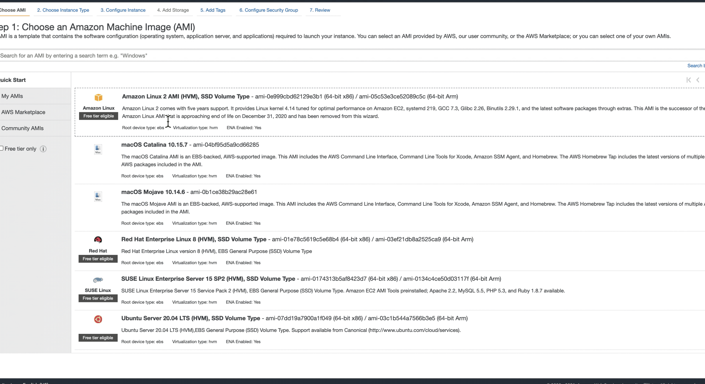

# Cleanup Bucket
Cleanup bucket is a helpful tool to cleanup an Amazon S3 bucket using Spot instances.  It can be launched from the EC2 Console. 


### Recommendations
- Use an instance type similar to `r5n.xlarge` for Amazon S3 buckets containing many objects.  
	- Amazon S3 buckets with Greater than 1 Million objects are considered large buckets 
	- `Large Bucket` > `1 Million objects`
- Use Large EBS storage volumbes capable of sufficient IOPS to avoid slow log file storage (if configured)
	- `IOPS` > `3,000`
- Tag instances to allow easy monitoring using the AWS Console
	- `Name` : `Cleanup Bucket (Spot)`
- Be sure your IAM Role allows write access to the Elasticsearch domain used
- Enable Amazon S3 Bucket Metrics
- Consider using S3 bucket policy to expire all versioned and non-versioned objects
- If possible, [cleanup using an Amazon S3 Bucket policy](https://docs.aws.amazon.com/AmazonS3/latest/dev/delete-or-empty-bucket.html#empty-bucket-lifecycle)
- Note: "You are not charged for storage time associated with an object that has [expired](https://docs.aws.amazon.com/AmazonS3/latest/dev/lifecycle-expire-general-considerations.html)"


## Instructions

### 1. Copy and Paste the `User Data` script below when launching an EC2 instance.  
	-Recommended:  `r5n.xlarge`


```
#!/bin/bash
#################################################################
## Create directory
#################################################################
yum update -y
DIR=/home/ec2-user/cleanupBucketDirectory
REPO=https://raw.githubusercontent.com/drumadrian/cleanup-bucket/main
mkdir $DIR
cd $DIR


#################################################################
## Download files from GitHub
#################################################################
curl $REPO/requirements.txt -o requirements.txt
curl $REPO/cleanupBucket.py -o cleanupBucket.py


#################################################################
## Use Environment Variables 
#################################################################
export logging_level="INFO"
export bucket_name="default-cleanup-bucket"
export delete_bucket="False"
export es_index_name="python_logger_cleanupbucket"
export environment="Dev"
export es_host="elasticsearch-domain"


#################################################################
## install prerequisites
#################################################################
yum install python3 -y
pip3 install -r requirements.txt

#################################################################
## Start the bucket cleanup script
# Recommended: 
#       python3 $DIR/cleanupBucket.py >> $DIR/cleanupBucket_output.txt
#################################################################
python3 cleanupBucket.py


```

### 2. Update the Environment Variables in the `User Data` script above to use your configuration settings. 


## Environment Variables to edit in the script above:

```
logging_level
bucket_name
delete_bucket
es_index_name
environment
es_host
```


### 3. Optionally configure output file using the follow command substituion: 

Replace: 

`python3 /home/ec2-user/cleanupBucketDirectory/cleanupBucket.py`

With: 

`python3 /home/ec2-user/cleanupBucketDirectory/cleanupBucket.py >> cleanupBucket_output.txt`


### -Happy Cloud Computing-

#### Video demonstration: 


Screenshot:


[https://s3-us-west-2.amazonaws.com/files.adrianws.com/cleanupBucket.gif](https://s3-us-west-2.amazonaws.com/files.adrianws.com/cleanupBucket.gif)